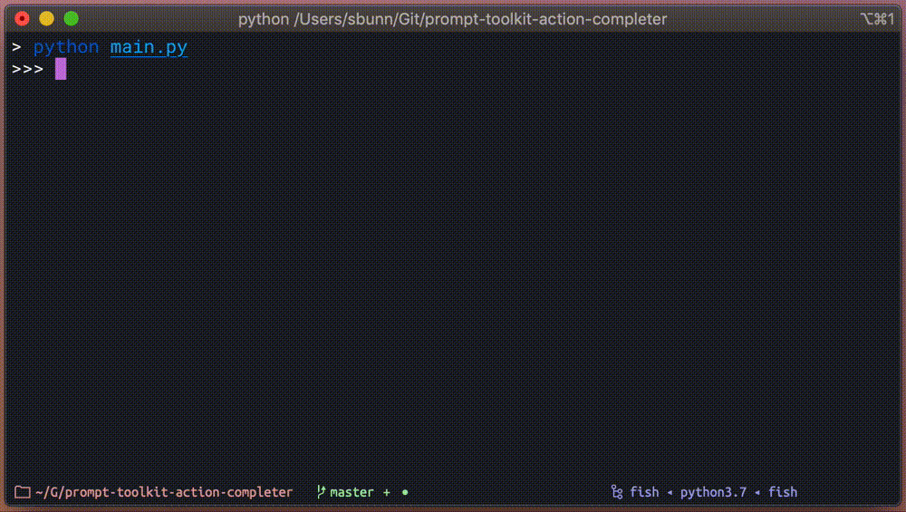

# Action Completer

[](https://pypi.org/project/prompt-toolkit-action-completer/)
[](https://github.com/stephen-bunn/prompt-toolkit-action-completer/actions?query=workflow%3A%22Test+Package%22)
[](https://codecov.io/gh/stephen-bunn/prompt-toolkit-action-completer)
[](https://prompt-toolkit-action-completer.readthedocs.org/)
[](https://black.readthedocs.io/en/stable/)

**A fairly simple method for registering callables as prompt-toolkit completions.**

This package provides the basic features to easily construct a custom completer using
decorators to reduce the amount of boilerplate needed to build basic tooling through
[prompt-toolkit](http://python-prompt-toolkit.readthedocs.io/en/stable).
A quick example is provided below, but if you are interested in the available features
and patterns you should read through [the documentation](https://prompt-toolkit-action-completer.readthedocs.org/).

This is a project that I originally created for myself several times when building
personal utilities with prompt-toolkit, and figured it might be useful for other people
to eventually use or extend.
As a side-effect of this being a personal utility, the provided functionality may not
*exactly* fit what you are looking for and the provided tests do not check all edge
cases properly yet.

```python
from pathlib import Path

from action_completer import ActionCompleter
from prompt_toolkit.shortcuts import prompt
from prompt_toolkit.completion import PathCompleter
from prompt_toolkit.validation import Validator

completer = ActionCompleter()


@completer.action("cat")
@completer.param(
  PathCompleter(),
  cast=Path,
  validators=[
      Validator.from_callable(
        lambda p: Path(p).is_file(),
        error_message="Path is not an existing file"
      )
  ]
)
def _cat_action(filepath: Path):
  with filepath.open("r") as file_handle:
      print(file_handle.read())


prompt_result = prompt(
  ">>> ",
  completer=completer,
  validator=completer.get_validator()
)
completer.run_action(prompt_result)
```


