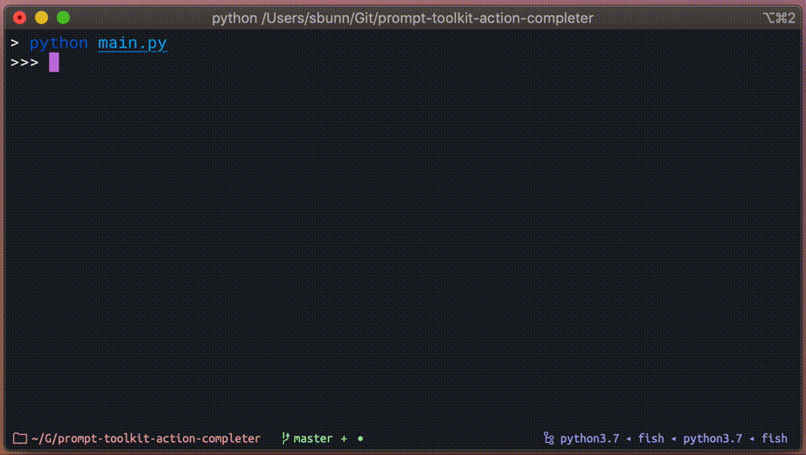
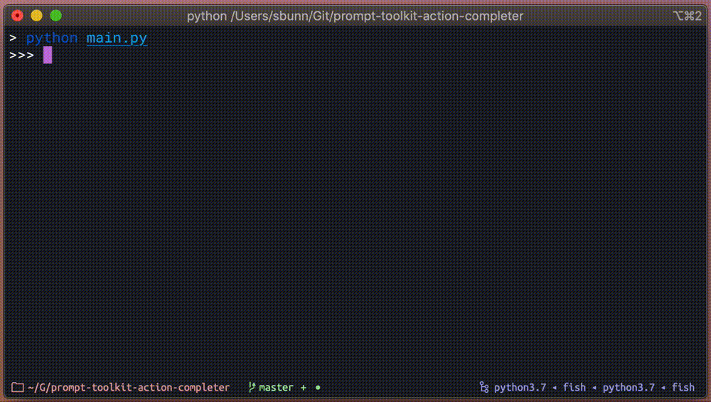
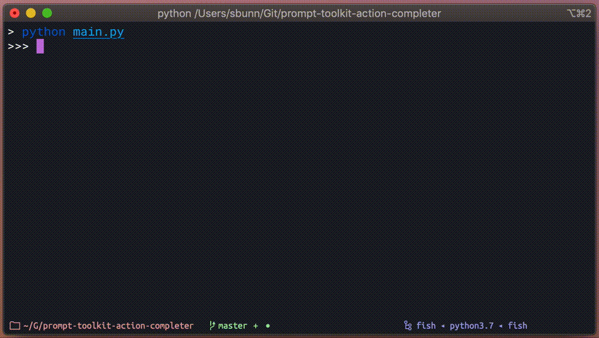
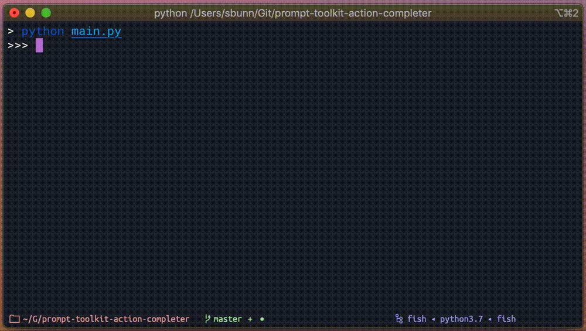

.. _getting-started:

===============
Getting Started
===============

| **Welcome to Action Completer!**
| This page should hopefully provide you with enough information to get you started
| with defining actions, groups, and parameters for use with prompt-toolkit.

Installation and Setup
======================

Installing the package should be super duper simple as we utilize Python's setuptools.

.. code-block:: bash

   $ poetry add prompt-toolkit-action-completer
   $ # or if you're old school...
   $ pip install prompt-toolkit-action-completer

Or you can build and install the package from the git repo.

.. code-block:: bash

   $ git clone https://github.com/stephen-bunn/prompt-toolkit-action-completer.git
   $ cd ./prompt-toolkit-action-completer
   $ poetry build
   $ pip install ./dist/*.whl

Usage
=====

This package supplies both a :class:`~.completer.ActionCompleter` and a
:class:`~.validator.ActionValidator` for direct use with prompt-toolkit.
You should be passing instances of the :class:`~.completer.ActionCompleter`
directly to the call to :func:`~prompt_toolkit.shortcuts.prompt` as the ``completer``
keyword argument.

.. code-block:: python

   from prompt_toolkit.shortcuts import prompt
   from action_completer import ActionCompleter
   completer = ActionCompleter()

   prompt(">>> ", completer=completer)

Defining Actions
----------------

This of course isn't very useful right now since we haven't registered any actions to
the completer. We can easily add a simple ``hello`` action by decorating a callable
**before** we make the call to :func:`~prompt_toolkit.shortcuts.prompt`:

.. literalinclude:: _static/assets/examples/000-simple-hello-completion.py
   :emphasize-lines: 8-10

With this little bit of logic we will automatically get ``hello`` completions from our
prompt call.

.. image:: _static/assets/recordings/000-simple-hello-completion.gif

Still not very useful though. We really want to be able to determine what action to
execute based on the output of our prompt call. Luckily, the completer can take whatever
output the prompt has produced and determine what action should be called.

We do this by using a new method on the completer,
:meth:`~.completer.ActionCompleter.run_action`. We can simply give this method the text
produced by the prompt and it will do it's best to execute the desired callable and
return whatever value the registered action returns:

.. literalinclude:: _static/assets/examples/001-simple-hello-completion.py
   :emphasize-lines: 13-14

.. image:: _static/assets/recordings/001-simple-hello-completion.gif

Now we have something that is fairly useful. Automatic completion and execution of some
registered callable. However, we will start to run into issues with the execution of
the action callable when the user starts providing inputs that the callable either isn't
expecting or can't handle. To protect against this, we can use the
:class:`~.validator.ActionValidator` to validate the prompt buffer state before we
attempt to execute the action.

Because the validator is a custom  validator that depends on the state of the completer,
it's recommended that you use another little helper method accessible right off of the
completer instance, :meth:`~.completer.ActionCompleter.get_validator`.
This helper method will give you a new instance of :class:`~.validator.ActionValidator`
that will be able to check that the current prompt can be adequately handled by the
registered action.

.. literalinclude:: _static/assets/examples/002-simple-hello-completion.py
   :emphasize-lines: 13

.. image:: _static/assets/recordings/002-simple-hello-completion.gif

That is the very basics of using the :class:`~.completer.ActionCompleter`, with this you
can easily get started creating some basic tools.
But we can get a lot more detailed and provide even more useful features by also
providing completion for action parameters!

Parameter Completion
--------------------

These actions won't be terribly useful unless we can supply some user specific inputs.
In order to help complete these parameters we need to also register the completable
parameters with the action we decorated.
We can easily do this using the :func:`~.types.param` decorator:

.. code-block:: python

   @completer.action("hello")
   @completer.param(None)
   def _hello_action(name: str):
      print(f"Hello, {name!s}!")

   prompt(">>> ", completer=completer)

.. image:: _static/assets/recordings/003-simple-hello-name-parameter.gif

You can now see that we are allowing for a parameter that is automatically provided to
the executed callable as the first parameter!
We are giving the :func:`~.types.param` decorator a ``source`` of ``None`` to indicate
that we don't necessarily want completion enabled for this parameter.

Completion Sources
::::::::::::::::::

There are many different available sources (some more useful than others).
These completion sources are the powerhouse of how parameters are selected by the user.

None (``None``)
~~~~~~~~~~~~~~~

None completions indicate that a parameter is required and gives you all the nifty
features of an action parameter, but doesn't attempt to do any real completion.

.. warning::
   A fairly big caveat of parameter completion for ``None`` source inputs, is that we
   don't support values containing spaces as properly handled inputs by the user.
   Values containing spaces are very difficult to distinguish from upcoming parameters.
   We do support the ability for users to escape spaces to include them in their
   parameter input.

   .. code-block:: bash

      >>> hello Stephen\ Bunn
      Hello, Stephen Bunn!

   However, this is fairly tedious and error-prone for the customer, so
   we recommend that you use other action parameter completion sources if you intend for
   the completable values to contain spaces.

Basic (``str``)
~~~~~~~~~~~~~~~

A basic string can be provided as a completion source that will force the value of the
parameter to always be whatever the value of this string is.
Might not seem very useful, but I've run into several situations when building dynamic
actions that this can help out with.

.. code-block:: python

   @completer.action("hello")
   @completer.param("world")
   def _hello_world_action(value: str):
      print(f"Hello, {value.title()!s}")

Iterable (``List[str]``)
~~~~~~~~~~~~~~~~~~~~~~~~

A list of strings can be provided to allow for multiple selections the user can make for
the parameter.
As long as the value they give is in this list of strings, the input will be considered
valid and will be passed through to the action.

This source is a good substitute if you want to be able to complete :class:`enum.Enum`
value and cast the value back to the enum instance in the action. Since prompt deals
only with strings (not enum values), it is easier for you to handle that decomposition
and casting from an enum yourself.

.. code-block:: python

   @completer.action("hello")
   @completer.param(["Mark", "John", "William"])
   def _hello_person_action(name: str):
      print(f"Hello, {name!s}")

.. _completion-source-completer:

Completer (``Completer``)
~~~~~~~~~~~~~~~~~~~~~~~~~

One of the more useful parameter sources is another
:class:`~prompt_toolkit.completion.Completer` instance.
We will give the appropriate parameter value to the nested completer and any completion
that the completer determines should be yielded will be yielded.

.. code-block:: python

   from prompt_toolkit.completion import PathCompleter

   @completer.action("cat")
   @completer.param(PathCompleter())
   def _cat_action(filepath: str):
      with open(filepath, "r") as file_handle:
         print(file_handle.read())

.. _completion-source-callable:

Callable (``Callable[[Action, ActionParam, str], Iterable[str]]``)
~~~~~~~~~~~~~~~~~~~~~~~~~~~~~~~~~~~~~~~~~~~~~~~~~~~~~~~~~~~~~~~~~~

Another useful parameter source is just a custom callable.
This callable should return some kind of iterable of strings that should be considered
completion results. As inputs, this callable will take the following positional
arguments:

- ``Action`` (:class:`~.types.Action`) - The action that is being triggered
- ``ActionParam`` (:class:`~.types.ActionParam`) - The associated action parameter that is requesting completions
- ``str`` (:class:`str`) - The current value of the action parameter

Whatever list, tuple, or generator of strings is returned will be used as the completion
results.

.. code-block:: python

   def _get_completions(action: Action, param: ActionParam, value: sr) -> Iterable[str]:
      return [str(value) for value in range(12)]

   @completer.action("hello")
   @completer.param(_get_completions)
   def _hello_dynamic_action(dynamic_value: str):
      print(f"Hello, {dynamic_value!s}")

Parameter Casting
-----------------

It gets pretty tedious to have to manually cast our parameter results from strings into
custom data types in the action itself. So give the ``cast`` keyword argument to the
:func:`~.types.param` decorator and we will do it for you automatically.

.. code-block:: python

   @completer.action("x2")
   @completer.param(["1", "2", "3"], cast=int)
   def _x2_action(num: int):
      print(f"Number {num!s} times 2 is {num * 2!s}")

Note, that we don't do anything clever when casting this value.
If you request us to cast the parameter to an :class:`int` and the string contains alpha
characters, it will fail with the traditional :class:`ValueError`.
To avoid this situation, continue reading on through to handling parameter validation.

Parameter Validation
--------------------

Going back to our ``cat`` action example in :ref:`completion-source-completer`, we can
greatly improve the usability of this by giving the action parameter some validation!
Simply pass a :class:`~prompt_toolkit.validation.Validator` instance as a value in the
``validators`` keyword argument, and you can ensure that the completed path is an
existing file.

.. literalinclude:: _static/assets/examples/004-cat-path-validation.py
   :emphasize-lines: 16-20

.. image:: _static/assets/recordings/004-cat-path-validation.gif

Because your parameter validation *may* require that you also take into consideration
the context of the parameter, you can also pass a custom validator callable.
Similar to the custom callable parameter completion sources available in
:ref:`completion-source-callable`, you can also pass a callable with a specific
signature to the ``validators`` list.
As inputs, this callable will take the following positional arguments:

- ``ActionParam`` (:class:`~.types.ActionParam`) - The associated action parameter that needs to be validated
- ``str`` (:class:`str`) - The current value of the action parameter
- ``List[str]`` (List[:class:`str`]) - The previously extracted prompt buffer fragments

This callable should raise a :class:`~prompt_toolkit.validation.ValidationError` when
validation fails.
For example, let's create an action that creates a new ``.txt`` file in a specified
directory and verifies that the file can safely be created:

.. literalinclude:: _static/assets/examples/005-advanced-touch-validation.py
   :emphasize-lines: 13-17,30

By default, the :class:`~.validator.ActionValidator` will validate that you are
providing the **exact** amount of parameters for an action.
If you need to allow for the user to enter additional text into the prompt past the
defined parameters, you can set the ``capture_all`` flag on the action to ``True``.
This will disable the check for an exact number of parameters and will instead ensure
that the user gives at least the number of defined parameters.

.. literalinclude:: _static/assets/examples/006-capture-all-action.py
   :emphasize-lines: 8,10,12

Nested Groups
-------------

Likely you will run into the situation where you want to create a subgroup of actions
under a specific completable name.
You can do this fairly easily by making use of the :meth:`~.types.ActionGroup.group`
method which will allow you to define a subgroup on an existing group.

Any related actions (or even additional nested subgroups) should be created by using the
:meth:`~.types.ActionGroup.action` or :meth:`~.types.ActionGroup.group` methods from the
newly created :class:`~.types.ActionGroup` instance.

.. literalinclude:: _static/assets/examples/005-nested-action-group.py
   :emphasize-lines: 11,14,19

.. important::
   Note that the :func:`~.types.param` decorator is only available from the
   :class:`~.completer.ActionCompleter` instance. You should always be using the
   completers instance that is sent to the :func:`~prompt_toolkit.shortcuts.prompt`
   call to register any parameters for **any** actions (no matter how nested they are).

   .. code-block:: python

      nested_group = completer.group("nested-group")

      # Invalid, @param is not available on the group
      @nested_group.action("invalid-action")
      @nested_group.param(None)
      def _invalid_action(invalid_param):
         ...

      # Valid, always use @param from the completer
      @nested_group.action("valid-action")
      @completer.param(None)
      def _valid_action(valid_param):
         ...

Styling Completions
-------------------

Now that we have some context into how we create groups, actions, and parameters, we can
talk about customizing the style of the completions.
Each :class:`~.types.ActionGroup`, :class:`~.types.Action`, and
:class:`~.types.ActionParam` has the ``style``, ``selected_style``, ``display``, and
``display_meta`` properties.

Color
:::::

If you want to change the coloring of the completion results, you can use the ``style``
and ``selected_style`` properties to do so.
These styles are given directly to the :class:`~prompt_toolkit.completion.Completion`
instance and will result in the completion results being styled all the same way:

.. literalinclude:: _static/assets/examples/007-color-completions.py
   :emphasize-lines: 11-12

Both ``style`` and ``selected_style`` can be lazily evaluated if necessary.
Simply pass a callable with a signature similar to the following:

.. code-block:: python

   from action_completer.types import ActionCompletable_T

   def dynamic_style(completable: ActionCompletable_T, completable_value: str) -> str:
      ...

For example, let's say we want to style the "John" completion with a blue background and
leave everyone else with a red background:

.. literalinclude:: _static/assets/examples/008-dynamic-color-completions.py
   :emphasize-lines: 8-14,20

.. warning::
   Take note of the return type for the dynamic style value.
   This callable has the constraint that it **requires** we always return a string
   of some kind; it should never be allowed to return ``None``.
   To omit from styling a completion, simply return an empty string.
   Typically it is safest to return early for any desired stylings you would like to
   apply and leave an empty string as the last available return value at the bottom of
   the callable:

   .. code-block:: python

      def dynamic_style(completable: ActionCompletable_T, completable_value: str) -> str:
         # logic to determine the desired style for a completion result
         ...

         # always return AT LEAST an empty string
         return ""

Text
::::

You can customize the actual display of the completion text itself by passing some
string to the ``display`` keyword argument:

.. literalinclude:: _static/assets/examples/009-display-completions.py
   :emphasize-lines: 8

.. image:: _static/assets/recordings/009-display-completions.gif

We can also pass an instance of :class:`~prompt_toolkit.formatted_text.FormattedText` to
``display`` to get some pretty fancy completions:

.. literalinclude:: _static/assets/examples/010-display-formattedtext-completions.py
   :emphasize-lines: 1,9

Similar to the ``style`` and ``selected_style`` properties, we can define the
``display`` lazily through a callable.
The callable for the ``display`` should have a signature similar to the following:

.. code-block:: python

   from typing import Union

   from prompt_toolkit.formatted_text import FormattedText
   from action_completer.types import ActionCompletable_T

   def dynamic_display(
      completable: ActionCompletable_T, completable_value: str
   ) -> Union[str, FormattedText]:
      ...

You can also easily include the completion value within a string or
:class:`~prompt_toolkit.formatted_text.FormattedText` instance without having to do
anything fancy by supplying a ``{completion}`` format in the ``display`` or
``display_meta`` values.
For example:

.. code-block:: python

   @completer.action("hello-world")
   @completer.param(["1", "2", "3"], display="Value {completion}")
   def hello_world(number_value: str):
      print(f"Hello, {number_value!s}")

This will produce completions using the display ``Value 1``, ``Value 2``, and
``Value 3``.
Somewhat useful if you don't want to go through the effort of defining a callable to
just place completion values in your completion's display or descriptions.

Description
:::::::::::

If you would like to add a little helpful description to a completion, you can do so
through the ``display_meta`` keyword argument.

.. literalinclude:: _static/assets/examples/011-display-meta-completions.py
   :emphasize-lines: 8

Everything that you can do with ``display``, you can also do with ``display_meta``.
For more details about what kind of formats you can display, you should read through the
`prompt-toolkit documentation <https://python-prompt-toolkit.readthedocs.io/en/stable/index.html>`_

Conditional Actions
-------------------

Both :class:`~.types.Action` and :class:`~.types.ActionGroup` can be gated behind a
:class:`~prompt_toolkit.filters.Filter` to indicate if the action or group should be
considered completable.
This filter is provided through the ``active`` keyword argument; by default it is set to
``None``.
If this filter is provided, it will be evaluated during completion and, if it evaluates
to a falsy value, completion will not occur for the associated action or group.

For example, here is a quick (and dirty) method for only allowing a ``hello`` action to
run once the user has first called ``activate``:

.. literalinclude:: _static/assets/examples/012-conditional-actions.py
   :emphasize-lines: 22,27,32

.. image:: _static/assets/recordings/012-conditional-actions.gif

Custom Action Execution
-----------------------

If you ever need to tweak how the requested action is executed, you can fetch a
:func:`~functools.partial` instance from the completer instead of just calling
:meth:`~.completer.ActionCompleter.run_action`.
Use the :meth:`~.completer.ActionCompleter.get_partial_action` method with the output of
the prompt to get an callable for the desired action with the casted parameters applied:

.. literalinclude:: _static/assets/examples/013-custom-action-execution.py
   :emphasize-lines: 10,12,16,18-19

----

| **There you have it.**

That is a basic overview of the features currently available in the
:class:`~.completer.ActionCompleter`.
To understand more about what is available to help to construct basic autocompletion for
prompt interfaces, I would recommend you read through the
`prompt-toolkit documentation <https://python-prompt-toolkit.readthedocs.io/>`_ and
continue on reading through the :ref:`action_completer` internal reference docs.
