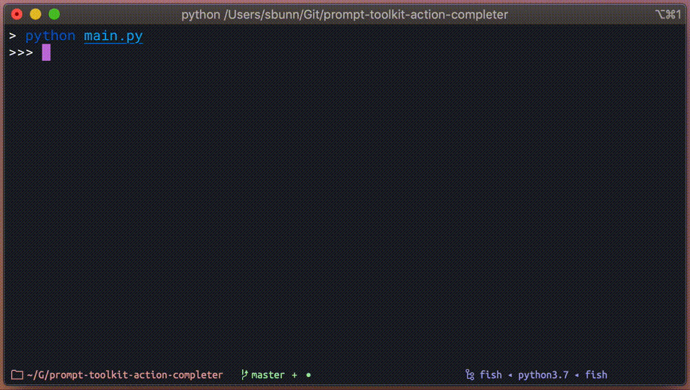
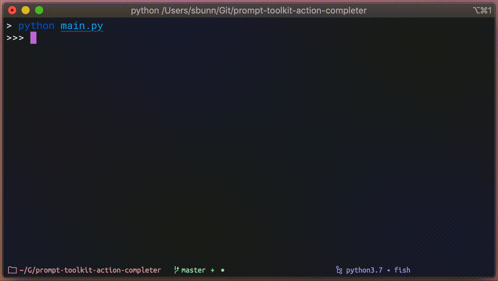

.. _getting-started:

===============
Getting Started
===============

| **Welcome to Action Completer!**
| This page should hopefully provide you with enough information to get you started
| with defining actions, groups, and parameters for use with prompt-toolkit.

Installation and Setup
======================

Installing the package should be super duper simple as we utilize Python's setuptools.

.. code-block:: bash

   $ poetry add prompt-toolkit-action-completer
   $ # or if you're old school...
   $ pip install prompt-toolkit-action-completer

Or you can build and install the package from the git repo.

.. code-block:: bash

   $ git clone https://github.com/stephen-bunn/prompt-toolkit-action-completer.git
   $ cd ./prompt-toolkit-action-completer
   $ poetry build
   $ pip install ./dist/*.whl

Usage
=====

This package supplies both a :class:`~.completer.ActionCompleter` and a
:class:`~.validator.ActionValidator` for direct use with prompt-toolkit.
You sould be passing instances of the :class:`~.completer.ActionCompleter`
directly to the call to :func:`~prompt_toolkit.shortcuts.prompt` as the ``completer``
keyword argument.

.. code-block:: python

   from prompt_toolkit.shortcuts import prompt
   from action_completer import ActionCompleter
   completer = ActionCompleter()

   prompt(">>> ", completer=completer)

This of course isn't very useful right now since we haven't registered any actions to
the completer. We can easily add a simple ``hello`` action by decorating a callable
**before** we make the call to :func:`~prompt_toolkit.shortcuts.prompt`:

.. code-block:: python

   from prompt_toolkit.shortcuts import prompt
   from action_completer import ActionCompleter
   completer = ActionCompleter()

   @completer.action("hello")
   def _hello_action():
      print("Hello, World!")

   prompt(">>> ", completer=completer)

With this little bit of logic we will automatically get ``hello`` completions from our
prompt call.

Still not very useful though. We really want to be able to determine what action to
execute based on the output of our prompt call. Luckily, the completer can take whatever
output the prompt has produced and determine what action should be called.

We do this by using a new method on the completer,
:meth:`~.completer.ActionCompleter.run_action`. We can simply give this method the text
produced by the prompt and it will do it's best to execute the desired callable and
return whatever value the registered action returns:

.. code-block:: python

   prompt_result = prompt(">>> ", completer=completer)
   completer.run_action(prompt_result)

Now we have something that is fairly useful. Automatic completion and execution of some
registered callable. However, we will start to run into issues with the execution of
the action callable when the user starts providing inputs that the callable either isn't
expecting or can't handle. To protect against this, we can use the
:class:`~.validator.ActionValidator` to validate the prompt buffer state before we
attempt to execute the action.

Because the validator is a custom  validator that depends on the state of the completer,
it's recommended that you use another little helper method accessible right off of the
completer instance, :meth:`~.completer.ActionCompleter.get_validator`.
This helper method will give you a new instance of :class:`~.validator.ActionValidator`
that will be able to check that the current prompt can be adequately handled by the
registered action.

.. code-block:: python

   prompt_result = prompt(">>> ", completer=completer, validator=completer.get_validator())
   completer.run_action(prompt_result)

That is the very basics of using the :class:`~.completer.ActionCompleter`, with this you
can easily get started creating some basic tools.
But we can get a lot more detailed and provide even more useful features by also
providing completion for action parameters!

Parameter Completion
--------------------

These actions won't be terribly useful unless we can supply some user specific inputs.
In order to help complete these parameters we need to also register the completable
parameters with the action we decorated.
We can easily do this using the :func:`~.types.param` decorator:

.. code-block:: python

   @completer.action("hello")
   @completer.param(None)
   def _hello_action(name: str):
      print(f"Hello, {name!s}!")

   prompt(">>> ", completer=completer)

You can now see that we are allowing for a parameter that is automatically provided to
the executed callable as the first parameter!
We are giving the :func:`~.types.param` decorator a ``source`` of ``None`` to indicate
that we don't necessarily want completion enabled for this parameter.

Completion Sources
::::::::::::::::::

There are many different available sources (some more useful than others).
These completion sources are the powerhouse of how parameters are selected by the user.

None (``None``)
~~~~~~~~~~~~~~~

None completions indicate that a parameter is required and gives you all the nifty
features of an action parameter, but doesn't attempt to do any real completion.

.. warning::
   A fairly big caveat of parameter completion for ``None`` source inputs, is that we
   don't support values containing spaces as properly handled inputs by the user.
   Values containing spaces are very difficult to distinguish from upcomming parameters.
   We do support the ability for users to esacape spaces to include them in their
   parameter input.

   .. code-block:: bash

      >>> hello Stephen\ Bunn
      Hello, Stephen Bunn!

   However, this is fairly tedious and error-prone for the customer, so
   we recommend that you use other action parameter completion sources if you intend for
   the completable values to contain spaces.

Basic (``str``)
~~~~~~~~~~~~~~~

A basic string can be provided as a completion source that will force the value of the
parameter to always be whatever the value of this string is.
Might not seem very useful, but I've run into several sittuations when building dynamic
actions that this can help out with.

.. code-block:: python

   @completer.action("hello")
   @completer.param("world")
   def _hello_world_action(value: str):
      print(f"Hello, {value.title()!s}")

Iterable (``List[str]``)
~~~~~~~~~~~~~~~~~~~~~~~~

A list of strings can be provided to allow for multiple selections the user can make for
the parameter.
As long as the value they give is in this list of strings, the input will be considered
valid and will be passed through to the action.

This source is a good substitute if you want to be able to complete :class:`enum.Enum`
value and cast the value back to the enum instance in the action. Since prompt deals
only with strings (not enum values), it is easier for you to handle that decomposition
and casting from an enum yourself.

.. code-block:: python

   @completer.action("hello")
   @completer.param(["Mark", "John", "William"])
   def _hello_person_action(name: str):
      print(f"Hello, {name!s}")

.. _completion-source-completer:

Completer (``Completer``)
~~~~~~~~~~~~~~~~~~~~~~~~~

One of the more useful parameter sources is another
:class:`~prompt_toolkit.completion.Completer` instance.
We will give the appropriate parameter value to the nested completer and any completion
that the completer determines should be yielded will be yielded.

.. code-block:: python

   from prompt_toolkit.completion import PathCompleter

   @completer.action("cat")
   @completer.param(PathCompleter())
   def _cat_action(filepath: str):
      with open(filepath, "r") as file_handle:
         print(file_handle.read())

Callable (``Callable[[Action, ActionParam, str], Iterable[str]]``)
~~~~~~~~~~~~~~~~~~~~~~~~~~~~~~~~~~~~~~~~~~~~~~~~~~~~~~~~~~~~~~~~~~

Another useful parameter source is just a custom callable.
This callable should return some kind of iterable of strings that should be considered
completion results. As inputs, this callable will take the following positional
arguments:

- ``Action`` (:class:`~.types.Action`) - The action that is being triggered
- ``ActionParam`` (:class:`~.types.ActionParam`) - The associated action parameter that is requesting completions
- ``str`` (:class:`str`) - The current value of the action parameter

Whatever list, tuple, or generator of strings is returned will be used as the completion
results.

.. code-block:: python

   def _get_completions(action: Action, param: ActionParam, value: sr) -> Iterable[str]:
      return [str(value) for value in range(12)]

   @completer.action("hello")
   @completer.param(_get_completions)
   def _hello_dynamic_action(dynamic_value: str):
      print(f"Hello, {dynamic_value!s}")

Parameter Casting
-----------------

It gets pretty tedious to have to manually cast our parameter results from strings into
custom data types in the action itself. So give the ``cast`` keyword argument to the
:func:`~.types.param` decorator and we will do it for you automatically.

.. code-block:: python

   @completer.action("x2")
   @completer.param(["1", "2", "3"], cast=int)
   def _x2_action(num: int):
      print(f"Number {num!s} times 2 is {num * 2!s}")

Note, that we don't do anything clever when casting this value.
If you request us to cast the parameter to an :class:`int` and the string contains alpha
characters, it will fail with the traditional :class:`ValueError`.
To avoid this sittuation, continue reading on through doing parameter validation.

Parameter Validation
--------------------

Going back to our ``cat`` action example in :ref:`completion-source-completer`, we can
greatly improve the usability of this by giving the action parameter some validation!
Simply pass a :class:`~prompt_toolkit.validation.Validator` instance as a value in the
``validators`` keyword argument, and you can ensure that the completed path is an
existing file.

.. code-block:: python

   from pathlib import Path
   from prompt_toolkit.completion import PathCompleter
   from prompt_toolkit.validation import Validator

   @completer.action("cat")
   @completer.param(
      PathCompleter(),
      cast=Path,
      validators=[
         Validator.from_callable(
            lambda p: Path(p).is_file(),
            error_message="Path is not an existing file"
         )
      ]
   )
   def _cat_action(filepath: Path):
      with filepath.open("r") as file_handle:
         print(file_handle.read())

   prompt_result = prompt(">>> ", completer=completer, validator=completer.get_validator())
   completer.run_action(prompt_result)

.. image:: _static/assets/recordings/004-cat-path-validation.gif

Nested Groups
-------------

Styling Completions
-------------------

Registering Actions
-------------------

Conditional Actions
-------------------

Custom Action Execution
-----------------------
